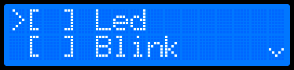

# ProMenu Library
ProMenu Library is used for fast implementing advanced user menus.
It supports nesting, numeric settings, text settings, boolean values and events.
Library is implemented in C++ with build-in Arduino port, but it is easy to
port to different architecture.

## Features
* asynchronous non-blocking API based on events callbacks
* fully static implementation without dynamic allocation
* hardware independent high-level architecture
* abstract display interface, for easy porting
* object-oriented architecture for easy extending
* data independent model with interface classes
* support numeric, text, and boolean settings
* most of the configurable items can be placed at flash without ram
* limited only by available memory number of menu/submenu items
* build-in ready to use driver adapters classes
* easy to use with Arduino boards (with separated drivers depencency)
* correct handling of single and multi-line displays
* customizable display clipping, leaves remaining area for application
* auto-scrolling for long menu item names

## Todo
- [ ] menu item shortcuts
- [ ] ascii keyboard support

## Code generator

## Example

Checkbox menu definition example:


```cpp
LcdShieldDisplay display{};

MenuManager menuManager(display);

const MenuItemCheckbox checkboxLed(0, "Led", checkboxManager);
const MenuItemCheckbox checkboxBlink(1, "Blink", checkboxManager);
const MenuItemCheckbox checkboxBacklight(2, "Backlight", checkboxManager);

const MenuItem *menuItems[] = {&checkboxLed, &checkboxBlink, &checkboxBacklight};
Menu menu(0, "menu", menuItems, sizeof(menuItems) / sizeof(menuItems[0]));
```
